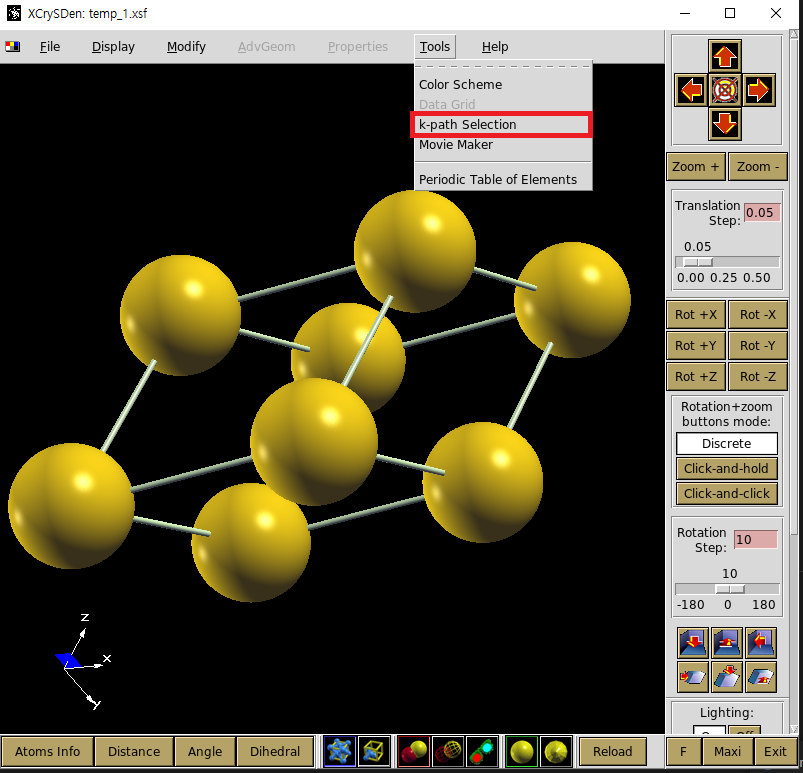
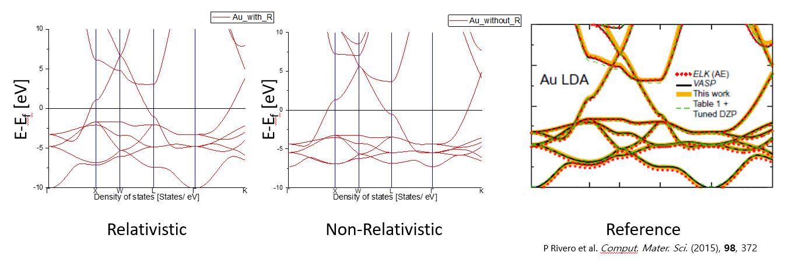

Tutorial 4: pseudopotential test

------------------------------------------

### Tutorial의 목적

pseudopotential을 만든 이유는 보통 계산에 사용하기 위에서이다. 그러나, pseudopotential의 4가지 조건을 확인한 것 만으로는 pseudopotential이 계산에 적합한지 부적합한지 알기 어렵다. 이번에 해볼 Tutorial은 다양한 계산을 통해 만든 pseudopotential이 적합한지 확인해보겠다.

### 사용할 Pseudopotential

Tutorial 3에서 언급했듯이 원자번호가 큰 원자는 상대론적 효과가 나타난다. 원자번호가 클수록 양성자의 개수가 많아지며, 전자를 잡아당기는 인력이 증가한다. 전자는 공전궤도를 유지하기 위해 속도를 계속 올리게 되고, 빛의 속도에 가까워지게 된다. 이러면 상대성 이론에 의해 전자의 질량이 늘어나고, 무거워진 전자는 원자핵에 근접한 상태로 공전한다. 따라서 전자의 가리움효과가 더 커져 d나 f오비탈의 전자들의 궤도에 변형이 생긴다. 이와 같은 이유로 원자번호가 큰 원소는 상대론적 효과를 고려해주어야 한다.  
이 tutorial에서 사용할 원소는 79번 Au 원소이다. Pseudopotential을 생성할 때 다른 조건은 전부 그대로 두고 상대론적 효과 옵션인 'r'옵션만 키고 끈 후에 계산을 진행해보겠다.

### Pseudopotential 생성

우선 atom코드에서 사용할 input 코드를 가져와야 한다. atom에서 사용할 reference 코드는 [pseudo](https://departments.icmab.es/leem/SIESTA_MATERIAL/Databases/Pseudopotentials/periodictable-intro.html)에서 가져올 수 있다. 페이지에서 LDA를 선택한 후, Au를 선택하고, "input file for the ATOM program"을 선택한다. 그러면 Au.inp파일을 받을 수 있다.

Au.inp

```bash
   pg                 -- file generated from Au ps file
        tm2
   Au   ca 
     0.000     0.000     0.000     0.000     0.000     0.000
   12    4
    6    0     1.000     0.000    #6s
    6    1     0.000     0.000    #6p
    5    2    10.000     0.000    #5d
    5    3     0.000     0.000    #5f
   2.63000   2.77000   2.63000   2.63000   0.00000   0.00000

#23456789012345678901234567890123456789012345678901234567890      Ruler
```

Au pseudopotential에 상대론적 효과 옵션을 넣기 위해서는 r옵션을 넣어주어야 한다. 이 옵션은 ca오른쪽에 넣어주면 된다. 주의할 점은 위치이다. r옵션은 Ruler의 첫번째 0 위에 반드시 위치해야한다. 만약 이 위치가 다르다면 atom으로 pseudopotential을 생성할 때 에러 메세지가 생길 것이다.

사용 불가능한 Au.inp

```bash
   pg                 -- file generated from Au ps file
        tm2    2.63
   Au    car  #위치가 잘못됨
     0.000     0.000     0.000     0.000     0.000     0.000
   12    4
    6    0     1.000     0.000    #6s
    6    1     0.000     0.000    #6p
    5    2    10.000     0.000    #5d
    5    3     0.000     0.000    #5f
   2.63000   2.77000   2.63000   2.63000   0.00000   0.00000

#23456789012345678901234567890123456789012345678901234567890      Ruler
```

상대론적 효과 이외에도 계산 과정에서 xc를 바꾸거나 rc를 바꾸거나 해야할 수 있다. 이런 옵션들을 알아보려면 [atom manual](https://siesta-project.org/SIESTA_MATERIAL/Pseudos/Code/atom-4.2.0.pdf)을 찾아보면 된다.

## 1. lattice constant

우선적으로 해볼 일은 각 Au의 lattice constant를 찾는 것이다. Au는 fcc cell을 가지는 금속이다. Au의 fcc 모델은 [materials project](https://materialsproject.org/)에서 가져오거나, materials studio로 직접 만들면 된다.

{: align=left style="width:300px"}

|          Basis size          |             DZP             |
| :--------------------------: | :-------------------------: |
|      Basis energy shift      |          100[meV]           |
|              XC              |             LDA             |
|            DM.tol            |          10^-3[eV]          |

 - Q.1 : 원자간 간격은 2~3Ang정도 되는데 왜 lattice constant는 4가 넘을까?
 - Q.2 : DM.tolerance의 의미가 무엇일까? 어떻게 설정해주는 것이 옳을까?

lattice constant를 찾기 전 k-point test를 해야한다. k-point test는 [1,1,1]을 시작으로 일정한 간격을 더해주면서 진행하면 된다. Au bulk이므로 xyz 방향 모두 반복되는 구조이다. 따라서 xyz 모든 값을 일정하게 더해준다. 계산을 해보면 k=35일 때 소수셋째자리까지 수렴한다.  


k-point를 구했다면 이번엔 정말 lattice constant를 구할 차례이다. lattice constant는 Tutorial 1에서와 마찬가지로 일정한 간격으로 lattice constant를 변화시키면서 에너지가 가장 낮은 lattice constant를 찾으면 된다. 이 tutorial에서는 원자간의 간격을 0.1Ang 단위로 바꾸어가며 계산했다. (계산의 효율을 위해 처음에는 sparse하게 계산한 후 에너지가 가장 낮은 값 근처에서 dense하게 계산하면 더 좋다.) 이후 polynomial fitting을 통해 에너지가 가장 낮은 구간을 찾았다.


|                  | lattice constant$[\overset{\circ}{A}]$ |
| :--------------: | :------------------------------------: |
| Non-relativistic |                 4.3144                 |
|   Relativistic   |                 4.0964                 |
|    Reference     |                 4.080                  |


위 결과를 보면 pseudopotential에 r옵션을 주었을 때 lattice constant가 4.0964[Ang]이고, 주지 않았을 때는 lattice constant가 4.3144[Ang]이다. 이를 reference인 4.080[Ang]와 비교할 때 r옵션을 주었을 때 reference와 훨씬 가깝다는 것을 확인할 수 있다. 따라서 Au Pseudopotential을 생성할 때 r옵션을 주는 경우가 훨씬 정확하다.

## 2. Band Structure

이번에는 Au bulk의 band를 그려서 두 pseudopotential에 어떤 차이가 있는지 알아보자. band structure를 그릴 때 사용할 [reference](https://www.sciencedirect.com/science/article/pii/S0927025614007940#t0015)는 이 band 그래프이다. 우리는 이 band 그래프를 siesta 계산을 통해 동일하게 한번 그려볼 것이다.  

{: style="width:300px"}

위 그래프에서 band path는 $\Gamma-X-W-L-\Gamma-K$순으로 진행되고 있음을 볼 수 있다. 이와 동일하게 그리려면 siesta의 옵션에 이와 동일하게 band path를 잡아줘야한다. 우선 xcrysden으로 band path를 잡는 방법과 이를 siesta에 적용하는 방법을 소개하도록 하겠다.
처음으로 model을 xcrysden로 열어준다. 그 이후 tools --> k-path selection을 선택하면 band path를 잡을 수 있는 화면이 나온다. 

{: style="width:300px"}

그 이후 해당하는 critical point를 선택해서 k-point를 올바르게 선택하면 된다. Au는 FCC구조이므로 아래 그림과 같은 brillouin zone에서 해당하는 점을 xcrysden에 선택하면 된다. [brillouin zone](https://wiki.fysik.dtu.dk/ase/ase/dft/bztable.html)

{: align=left style="height:300px"}

{style="height:300px"}

band path를 올바르게 선택했다면 band path selection에서 오른쪽에 적힌 숫자들을 tutorial 1에서 했던 것처럼 RUN.fdf에 넣으면 된다. RUN.fdf에 적어야하는 부분은 다음과 같다.

```bash
    BandLinesScale ReciprocalLatticeVectors
    %block BandLines
    1  0.0000 0.0000 0.0000 G
    60  0.5000 0.5000 0.0000 X
    60  0.7500 0.5000 0.2500 W
    60  0.5000 0.5000 0.5000 L
    60  0.0000 0.0000 0.0000 G
    60  0.7500 0.3750 0.3750 K
    %endblock BandLines
```

계산을 수행하면 *.bands파일이 나온다. 정확한 범위의 band structure를 그리려면 이 bands파일을 잘 이용해야한다. 우선, bands파일에 있는 맨 첫번째 숫자는 fermi energy를 뜻한다. 그리고 맨 마지막 부분의 숫자를 확인해보면 라벨이 달려있는 숫자 부분이 있는데 이 숫자들이 brillouin zone으로 x축에 대응되는 숫자들이다. 따라서 올바른 band를 그리려면 x축의 범위를 이 아래의 숫자로 맞춰줘야하고, y축으로는 fermi energy 기준으로 그려야할 범위를 정해야한다.

*.bands

```bash
  -3.50583946128311     #fermi energy
  0.000000000000000E+000   3.18573135134061     
  -10.7870979412504        78.0781178548763     
          15           1         301

    ...

           6            #band path
    0.000000   'G'       
    0.770656   'X'       
    1.155984   'W'       
    1.700920   'L'       
    2.368327   'G'       
    3.185731   'K'       
```

이런 과정을 거쳐 Au의 band structure를 그려보면 아래 그림과 같다.



페르미 에너지 위 5eV부분을 보면 relativistic의 band structure은 reference와 비슷하지만, non-relativistic의 band structure은 reference와 상이함을 알 수 있다. 따라서 Au pseudopotential은 relativistic 옵션을 켜야하고, 이를 키지 않을시 문제가 생길 수 있다는 것을 확인할 수 있다.

## 3. work function

마지막으로 두 경우의 work function을 확인해보자.