Editor : VsCode
====================================

## VsCode란?

* sublime text, emacs, vim와 같은 text editor (IDE가 아님)
* 거의 모든 언어의 편집을 지원(python, C, Markdown, Fortran, etc)
* extension의 설치로 여러가지 기능 추가 가능
* remote-ssh extension을 통해 클러스터의 파일관리와 작업 수행 가능
* 디버깅 지원, 내장 터미널 지원

## VsCode의 설치

1) 링크(<https://code.visualstudio.com/docs/?dv=win>)에서 VsCode의 설치파일 다운로드 후 실행

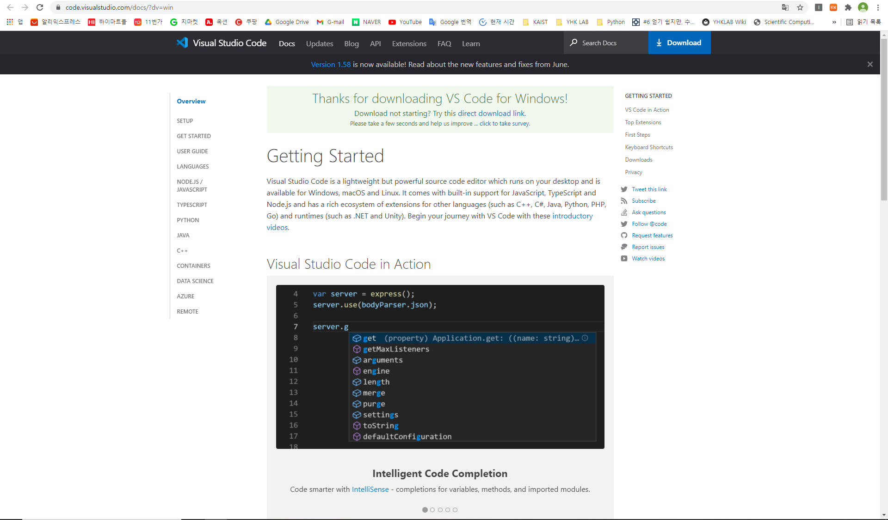

2) "동의합니다" 클릭 후 다음 클릭

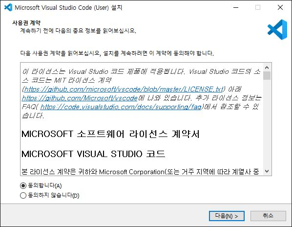

3) 경로 지정 후 다음 클릭

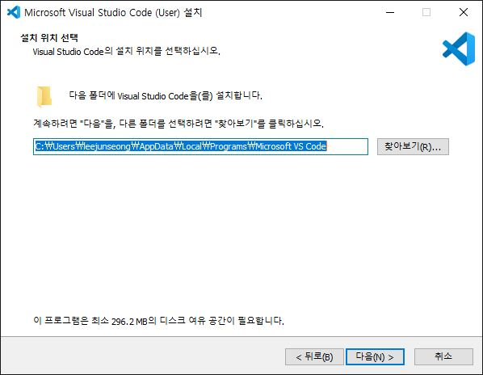

4) 다음 클릭

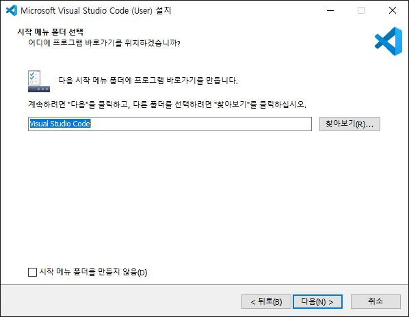

5) 원하는 항목 선택 후 다음 클릭

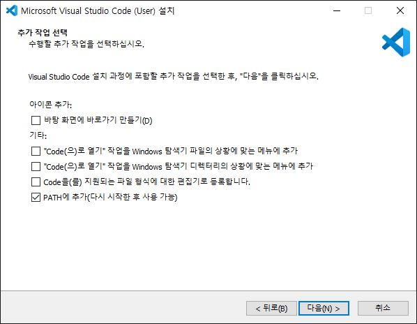

* PATH 에 추가 : cmd를 실행시킨 후 "code" 명령어를 치면 vscode 실행 가능하게 만듬  

6) 설치 클릭

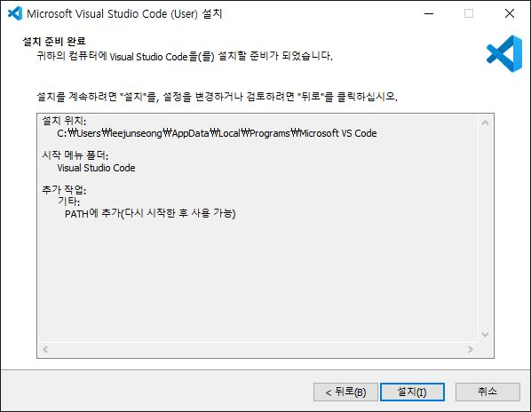

7) VsCode 설치 완료

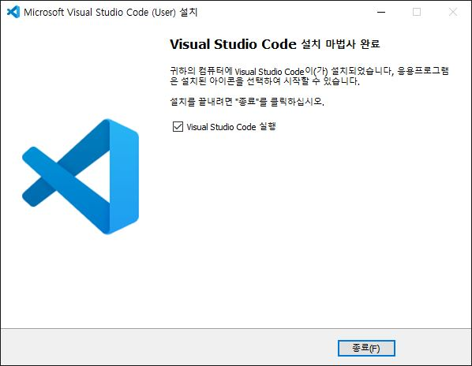

## VsCode 화면 구성

처음 VsCode를 실행시키면 다음과 같이 실행이 된다. VsCode는 다음과 같이 구성되어있다.


화면 왼쪽에 보면 여러가지 탭들이 있다. 이 탭들은 다음과 같고, 각자 어떤 기능인지 소개하도록 하겠다.

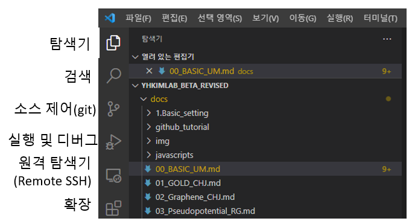

### 탐색기
폴더를 지정해서 열게 되면 다음과 같은 화면을 볼 수 있다.

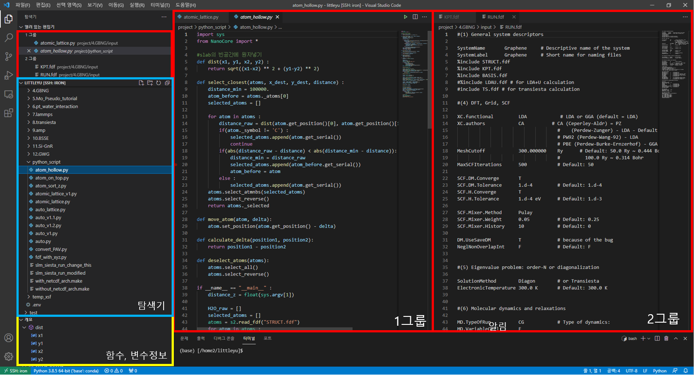

* 열려있는 편집기 : 현재 내가 VsCode로 열고 있는 파일 전체를 보여준다. 화면 분할을 할 수 있어 다른 파일을 동시에 편집할 수 있다. 그룹은 화면 분할된 탭끼리 묶인다.
* 탐색기 : 폴더 열기에서 열었던 폴더와 그 하위폴더들을 보여준다. 상위폴더로는 갈 수 없고 만약 상위폴더를 편집하고 싶다면 <u>파일 -> 폴더 열기</u>로 상위폴더를 다시 열어야한다.
* 개요 : 현재 내가 수정하고 있는 파일의 함수, 변수 정보를 나타낸다. 클릭하면 함수나 변수가 선언된 줄로 바로 이동한다.

### 검색
검색에 단어나 문장을 넣으면 VsCode로 연 폴더의 하위 폴더와 파일 내용을 전부 검색해서 보여준다. home폴더같은 상위폴더에 이 기능을 쓰면 리소스를 많이 사용하므로 프로그래밍을 하는 하위폴더에서 사용해야한다.

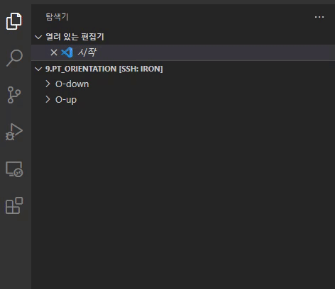

### 소스 제어
git에 기록된 파일과 수정한 파일들의 차이점을 보여준다.
git 폴더를 자동으로 검색하고 git에 기록된 부분을 빨간색, 현재 수정한 부분을 초록색으로 표시한다.

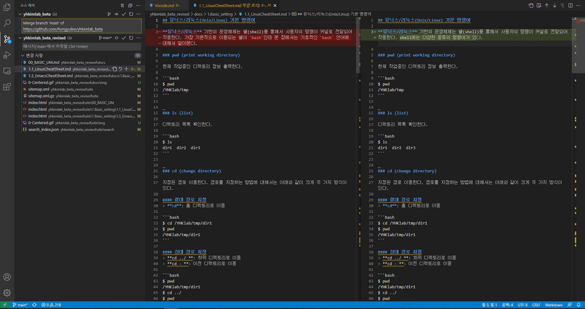

### 실행 및 디버깅
VsCode만으로 디버깅을 할 수 있다. 디버깅을 하기 전에 Launch.json을 수정해서 디버깅 환경을 설정해야한다. 가장 기본적인 디버깅 방법은 프로그램이 위치한 폴더에서 프로그램을 실행시키는 것이다. 이에 해당하는 launch.json파일은 다음과 같다.

```json
{
    "version": "0.2.0",
    "configurations": [
        {
            "name": "Python: Current File",
            "type": "python",
            "request": "launch",
            "program": "${file}",
            "console": "integratedTerminal",
            "cwd" : "${fileDirname}"
        }
    ]
}
```

이후에 디버깅 버튼을 누르면 디버깅을 할 수 있다. 다른 IDE와 동일하게 중단점을 설정하고, 변수의 내용을 확인하며 프로그램이 올바르게 동작하는지 확인할 수 있다.

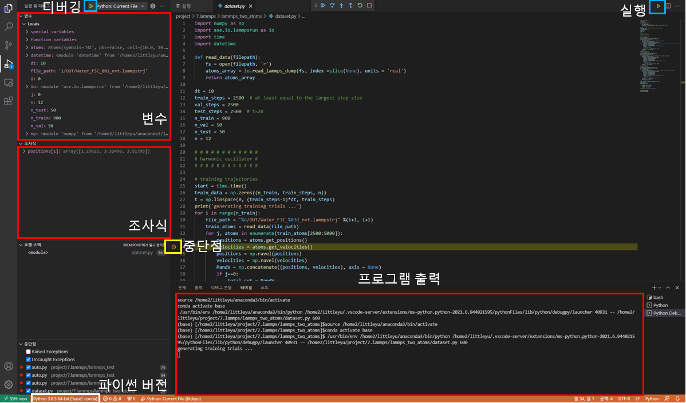

조사식을 통해 알고싶은 변수의 내용을 검색할 수 있고, 배열이나 클래스의 내용들을 모두 보여준다.

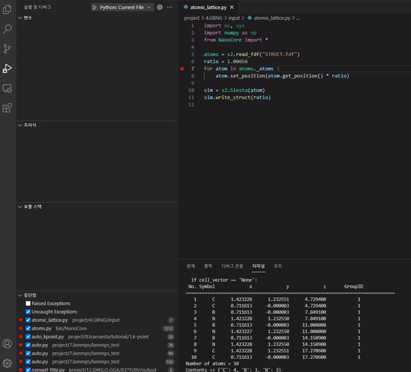

### 원격 탐색기
뒤에 나올 확장 탭에서 Remote development를 설치했을 경우 나오는 항목이다. ssh target으로 설정해주어야 한다. 연결한 서버와 서버에서 열었던 폴더들을 모두 보여준다.


### 확장

VsCode에 설치된 확장과 설치할 수 있는 extension들을 표시한다. extension의 이름을 검색하면 인터넷에서 설치할 수 있는 extension들을 표시해주고, 이를 설치할 수 있다.

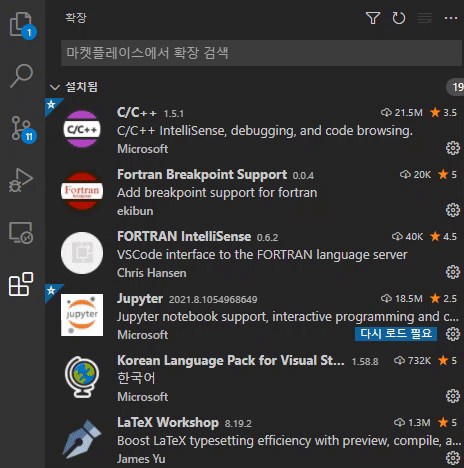

필수 설치 확장 리스트

* korean language pack
* python
* remote development
* modern fortran
* fortran intellisense (옵션)

## 서버와 연결

앞에서 언급했듯이 서버와 연결하려면 Remote Development 확장 프로그램을 설치해야 한다.  

1) 서버로 접속할 수 있는 방법은 2가지가 있다.

   * F1 -> remote-ssh 검색 -> Remote-SSH : Connect to Host 선택
   * 좌측 하단의 초록색 아이콘 클릭 -> connect host 클릭  

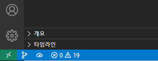

2) 다음과 같은 화면이 상단에 뜨게 되고, 기존에 터미널에서 접근했던 방법과 동일하게 명령어를 쳐서 서버에 접속한다.  
ssh 아이디@iron.kaist.ac.kr  


3) 새로운 창이 뜨면 linux, continue를 누르고 비밀번호를 입력 후 접속한다.
접속하면 VsCode를 처음에 실행시킬 때 나오는 화면이 출력되고, 좌측 하단의 초록색 아이콘에 연결된 호스트 이름이 뜨게된다.  

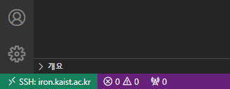

이후 탐색기에서 폴더를 열면 서버의 파일들을 보고 수정할 수 있다.

### X11 Forwarding

X11 forwarding을 위해 추가적인 설정을 해줘야 한다.

1) SSH TARGETS 항목 옆에 톱니바퀴 클릭 -> 맨 위 항목 클릭


2) config파일 나오면 다음 항목 추가

```bash
    ForwardX11 yes  
    ForwardAgent yes  
    ForwardX11Trusted yes  
```

결과적으로 config는 다음과 같이 구성된다.

```bash
    Host iron  
        HostName iron.kaist.ac.kr  
        User littleyu  
        ForwardX11 yes  
        ForwardAgent yes  
        ForwardX11Trusted yes    
```

3) 윈도우 시작 버튼 -> 시스템 환경 변수 편집 검색 후 실행

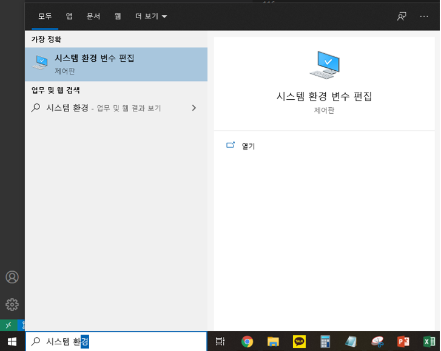

1. 환경변수 클릭 -> 새로만들기 클릭
2. 변수 이름에 DISPLAY, 변수 값에 127.0.0.1:0 입력
3. 전부 확인 누른 후 종료


4) xlaunch를 실행시킨 후 xeyes 명령어를 통해 x11 forwarding이 되는지 확인

된다면 이제 xcrysden과 같은 x11을 사용하는 프로그램들을 사용할 수 있다.

## 필수 확장 프로그램

파이썬과 포트란 개발에 필요한 extension을 소개하고, 설정 방법과 기능에 대해 소개해보도록 하겠다.

### Python : python

파이썬에서 사용하는 확장 프로그램은 python 하나만 설치해주면 된다. python을 설치하면 ipython notebook을 수정하기 위한 jupyter notebook과 language server인 pylance도 자동으로 설치된다.

#### 설정

1. 확장 -> python 옆의 톱니바퀴 클릭 후 확장 설정 클릭  
2. python: language server 항목을 jedi에서 pylance로 수정


#### 기능

1) Semantic highlighting


변수와 함수, 클래스에 색을 다르게 줘서 구분이 편리하도록 만드는 기능

2) Auto complete (자동 완성)


tab을 누르면 선택된 단어 자동완성

3) linting


틀린 문법을 빨간 물결로 표시, 문법을 어떻게 고쳐야 하는지도 알려줌

4) go to definition


함수나 변수가 정의된 파일로 바로 이동하는 기능

### fortran : modern fortran, fortran intellisense

포트란에서 사용하는 확장 프로그램은 두개로, modern fortran과 fortran intellisense 두개이다. 기본적인 syntax highlighting만 필요하다면 modern fortran만 필요하고, python extension에서 지원하는 다른 기능들은 fortran intellisense와 language server를 설치해야 적용된다.

#### 설정

1. modern fortran과 fortran intellisense 설치
2. "pip install fortran-language-server" 명령어로 fortran language server 설치
3. "which fortls"로 fortran language server 경로 확인
4. 확장 설정에서 fortran intellisense 항목 내 executable path에 찾은 경로 입력

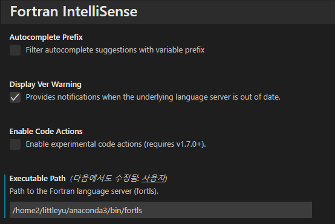

#### 기능

1) syntax highlighting


변수와 함수, 클래스에 색을 다르게 줘서 구분이 편리하도록 만드는 기능

2) Auto complete (자동 완성)


tab을 누르면 선택된 단어 자동완성

3) linting

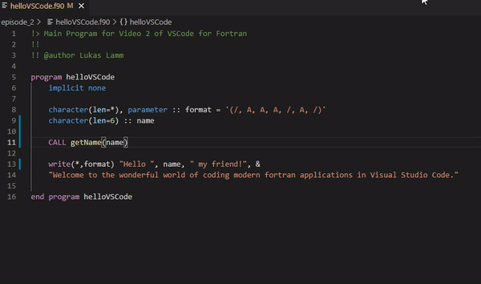

틀린 문법을 빨간 물결로 표시, 문법을 어떻게 고쳐야 하는지도 알려줌

4) go to definition


함수나 변수가 정의된 파일로 바로 이동하는 기능

